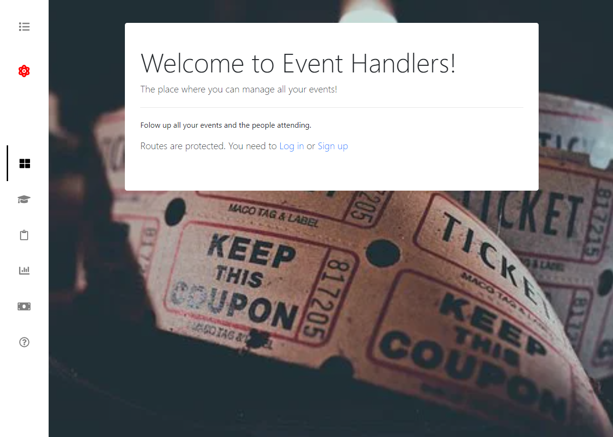

<!--
*** Thanks for checking out this README Template. If you have a suggestion that would
*** make this better, please fork the repo and create a pull request or simply open
*** an issue with the tag "enhancement".
*** Thanks again! Now go create something AMAZING! :D
-->

<!-- PROJECT SHIELDS -->
<!--
*** I'm using markdown "reference style" links for readability.
*** Reference links are enclosed in brackets [ ] instead of parentheses ( ).
*** See the bottom of this document for the declaration of the reference variables
*** for contributors-url, forks-url, etc. This is an optional, concise syntax you may use.
*** https://www.markdownguide.org/basic-syntax/#reference-style-links
-->
[![Contributors][contributors-shield]][contributors-url] 
[![Forks][forks-shield]][forks-url] 
[![Stargazers][stars-shield]][stars-url] 
[![Issues][issues-shield]][issues-url] 
 

# Events Controller react

>  A webapp to manage the tickets selling and attendance to events, users must register/login to access the protected routes, built with React&Redux.


Landing Page:


Episodes Page: 


Additional description about the project and its features.

## Built With

- CSS
- JAVASCRIPT
- NPM
- REACT
- REDUX
- ESLINT
- PRETTIER
- REACT INFINITE SCROLL COMPONENT
- REACT BOOTSTRAP
- LOCALSTORAGE
- GITHUB ACTIONS
- VSCODE

## Getting Started
- Follow the live demo link and enjoy the site.

### Usage
To have this app on your pc, you need to:
* [download](https://github.com/javitocor/Trekkie-World-Catalog/archive/development.zip) or clone this repo:
  - Clone with SSH:
  ```
    git@github.com:javitocor/Trekkie-World-Catalog.git
  ```
  - Clone with HTTPS
  ```
    https://github.com/javitocor/Trekkie-World-Catalog.git
  ```

* In the project directory, you can run:

  - `$ npm install` - installs all the dependencies required by the project

  - `$ npm start` - runs the app in the development mode:
    - Open [http://localhost:3000](http://localhost:3000) to view it in the browser.
    - The page will reload if you make edits.
    - You will also see any lint errors in the console.

  - `$ npm run test`
    - Launches the test runner in the interactive watch mode.
    - See the section about [running tests](https://facebook.github.io/create-react-app/docs/running-tests) for more information.

  - `$ npm run build`
    - Builds the app for production to the `build` folder.
    - It correctly bundles React in production mode and optimizes the build for the best performance.
    - The build is minified and the filenames include the hashes.
    - Your app is ready to be deployed!

## Future Features
- Add authentication endpoint.

## Author

👤 Javier Oriol Correas Sanchez Cuesta 
- Github: [@javitocor](https://github.com/javitocor) 
- Twitter: [@JavierCorreas4](https://twitter.com/JavierCorreas4) 
- Linkedin: [Javier Oriol Correas Sanchez Cuesta](https://www.linkedin.com/in/javier-correas-sanchez-cuesta-15289482/) 

## 🤝 Contributing

Contributions, issues and feature requests are welcome!

Feel free to check the [issues page](https://github.com/javitocor/Trekkie-World-Catalog/issues).

## Show your support

Give a ⭐️ if you like this project!

## Acknowledgments 🚀

- [React Documentation](https://reactjs.org/docs/getting-started.html)
- [Redux](https://redux.js.org/)
- [react infinite scroll component](https://github.com/ankeetmaini/react-infinite-scroll-component)
- [React Bootstrap](https://react-bootstrap.github.io/)

## 📝 License

This project is [MIT](lic.url) licensed.

<!-- MARKDOWN LINKS & IMAGES -->
<!-- https://www.markdownguide.org/basic-syntax/#reference-style-links -->
[contributors-shield]: https://img.shields.io/github/contributors/javitocor/Trekkie-World-Catalog.svg?style=flat-square
[contributors-url]: https://github.com/javitocor/Trekkie-World-Catalog/graphs/contributors
[forks-shield]: https://img.shields.io/github/forks/javitocor/Trekkie-World-Catalog.svg?style=flat-square
[forks-url]: https://github.com/javitocor/Trekkie-World-Catalog/network/members
[stars-shield]: https://img.shields.io/github/stars/javitocor/Trekkie-World-Catalog.svg?style=flat-square
[stars-url]: https://github.com/javitocor/Trekkie-World-Catalog/stargazers
[issues-shield]: https://img.shields.io/github/issues/javitocor/Trekkie-World-Catalog.svg?style=flat-square
[issues-url]: https://github.com/javitocor/Trekkie-World-Catalog/issues